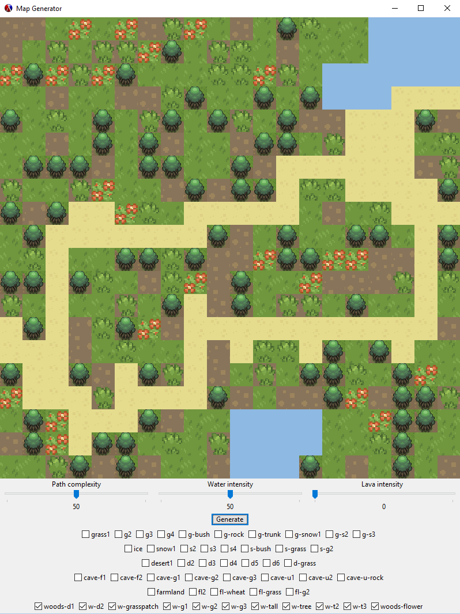

# Random Map Generator

My project is a map generator that generates random game tilemaps. The program allows the user to adjust the chance to generate certain elements of the map. The generate button can then be clicked to generate a unique map each time. The maps generated will always have a clear path from the left side to the right, without anything obstructing the path. 

Here's an example of a randomly generated map.

I used a lot of recursion in the randomization procedures for the path/water/lava. The randomization procedures also used local state variables that were modified within the procedure during that instance of the procedure call. They were used and modified to keep track of the number of water/lava tiles that could be generated during the recursive procedure. Mutable data was also used a lot in the procedures and for the array. Vectors were constantly being set to different values in order to move around and modify the array. 

racket/gui - Used for the UI and for printing the map to the window.  
math/array - Used for the array map. 
Everything else was already in the racket language.  
Free and modified graphics were used for the map. [Main Source](http://dionen.deviantart.com/art/Biome-Tiles-Public-274422390)  
